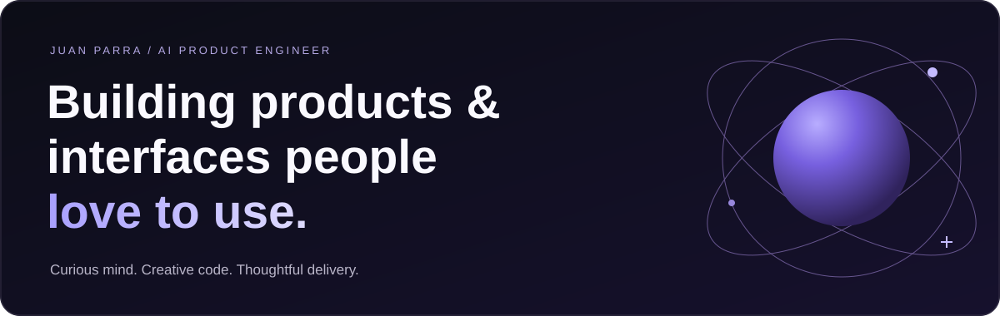

  <a href="https://www.jfparra.dev/"><strong>Explore my work ↗</strong></a>
  &nbsp;&nbsp;·&nbsp;&nbsp;
  <a href="https://www.linkedin.com/in/juanfparra12/">LinkedIn</a>
  &nbsp;&nbsp;·&nbsp;&nbsp;
  <a href="mailto:j.f.parra.001@gmail.com">Say hello</a>

 

## A little about me

I'm Juan, an **AI Product Engineer** who likes figuring out how things work and finding ways to make them better. I've built across insurance, education, infrastructure, legal tech, and web3. The part I enjoy most is turning a complex problem into a product that feels simple to use.

I care about the whole experience: how it looks, how it works, and how it helps someone get things done. These days, I'm exploring AI products and agentic workflows, while keeping the same focus on thoughtful interfaces and useful outcomes.

<table>
  <tr>
    <td width="50%" valign="top">
      <h3>01 / Products with purpose</h3>
      
Start with the person using it. Understand the problem, shape the experience, and ship something useful.

    </td>
    <td width="50%" valign="top">
      <h3>02 / Interfaces with care</h3>
      
Clear interactions, responsive experiences, and the small details that make a product enjoyable to use.

    </td>
  </tr>
  <tr>
    <td width="50%" valign="top">
      <h3>03 / AI that gets work done</h3>
      
Models, context, and tools working together, with people able to understand and guide the result.

    </td>
    <td width="50%" valign="top">
      <h3>04 / Learn, ship, improve</h3>
      
Prototype ideas, listen to feedback, measure what matters, and keep refining the experience.

    </td>
  </tr>
</table>

## Things I've helped bring to life

- **AI features for legal teams:** message classification and error categorization that help teams prioritize and act.
- **Onboarding and analytics experiences:** interfaces that help people get started and understand their data.
- **Internal agents and engineering tools:** technical Q&A, review workflows, and automation that help teams move work forward.
- **Creative experiments:** on-chain galleries, NFT experiences, and playful browser projects.

  <a href="https://www.jfparra.dev/"><strong>Take a look around my portfolio ↗</strong></a>

<strong>Under the hood / My toolkit</strong>

 

Python for services. Next.js and TypeScript for interfaces. AWS for cloud delivery.

| | Tools I work with |
| --- | --- |
| **Interfaces** | Next.js · React · TypeScript |
| **APIs & services** | Python · Flask · FastAPI |
| **Data** | SQL · PostgreSQL · MySQL |
| **Cloud & delivery** | AWS · Vercel |
| **Everyday tools** | Bash · Git · Linux |

## Away from the editor

Digital art, creative technology, and a good rabbit hole keep me curious. I like experimenting, sharing what I learn, and working with people who care about what they're making.

**University of Florida** · BS in Computer Science · Minor in Entrepreneurship 🐊

---

  <strong>Have an idea worth building?</strong> 
  Let's make something people enjoy using.  
  <a href="mailto:j.f.parra.001@gmail.com">Get in touch ↗</a>

